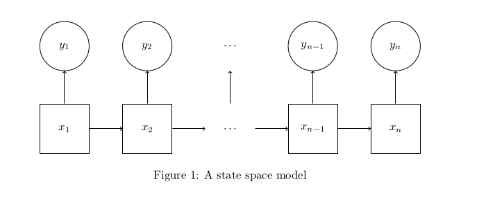

```{r setup, include=FALSE}
knitr::opts_chunk$set(echo = FALSE)
```

## State space models

```{r one , echo=FALSE}

```


## State space models

- $y_i$s are observed
- $y_i$s can be univariate, multivariate, vector-valued, matrix-valued, whatever
- $y_i$s can be discrete or continuous or both
- $x_i$s are unobserved
- $x_i$s can be any size or dimension as well
- $x_i$s can be discrete or continuous or both
- arrows represent conditional densities assumed by a particular SSM (parameterized by $\theta$)
- the book calls these hidden Markov models (although it is more common to use this word to refer to state space models where the states are discrete random variables)
- other words: graphical models, latent variable models, missing data models (eh), 


## State space models

```{r two, echo=FALSE}

```

## Conditional Independence


The state chain possesses the Markov property:

$$
q(x_k \mid x_{1:k}, \theta) = q(x_k \mid x_{k-1}, \theta)
$$
or
$$
q(x_{1:N}, \theta) = q(x_1 \mid  \theta)q(x_2 \mid x_1, \theta) \times \cdots \times q(x_N \mid x_{N-1}, \theta).
$$

The $y_i$s are conditionally independent from one another given all the states:

For $i\neq k$
$$
g(y_{1:N} \mid x_{1:N}, \theta) = \prod_{k=1}^N g(y_k \mid x_{1:N}, \theta) = \prod_{k=1}^N g(y_k \mid x_{k}, \theta).
$$


## Statistical Inference

We can use Bayes' rule to look at either

- $p(\theta \mid y_{1:N})$ (parameter inference), or
- $p(x_{1:N} \mid y_{1:N}, \theta)$ (state inference), or
- $p(x_{1:N}, \theta \mid y_{1:N}, \theta)$ (parameter and state inference).


We will focus on state inference, not parameter inference. Why?

- It isn't covered in any other class on campus (to my knowledge)
- Sometimes you need to understand state inference before you attempt parameter inference
- we'll look at recursive algorithms that work on streaming data (different than what you're used to)

## Particle filtering

We will focus on the sequence of distributions (in $k$)
$$
p(x_k \mid y_{1:k})
$$

It's very easy to use Bayes' rule to get recursive formulas. If you've used Bayes' rule before, though, you might be aware that sometimes the normalizing constant cannot be figured out with pencil and paper. Almost all "interesting" models will have elusive normalizing constants.

## Particle filtering

*Particle filtering* is 

- based on weighted samples (think importance sampling)
- recursive (old samples get "transformed" into new samples)

So it's "valid" for pretty much any state space model we can think of!

## Particle filtering

The downsides:

1. they're complicated to program 
    - potentially slow
    - compiled languages are useful but statisticians don't always know them very well
    - code reuse is handy ([plug](https://github.com/tbrown122387/pf))

2. asymptotic justification is nonstandard 
    - the samples "interact" and so are not iid
    - more particles/samples increases accuracy
    - the primary goal of this class is to prove a LLN and a CLT
    
## Particle filtering 

Here's an animation. Let's say we want the distributions

- $p(x_1 \mid y_1)$
- $p(x_2 \mid y_{1:2})$
- $p(x_3 \mid y_{1:3})$
- $\vdots$

where each $x_i$ is a continuous univariate random variable. We'll plot the samples for each of these distributions over time...

## Particle filtering

```{r, anim1, echo=FALSE}
knitr::include_graphics("../pics/pfilt_anim_1.png")
```

## Particle filtering

```{r, anim2, echo=FALSE}
knitr::include_graphics("../pics/pfilt_anim_2.png")
```


## Particle filtering

```{r, anim3, echo=FALSE}
knitr::include_graphics("../pics/pfilt_anim_3.png")
```


## Particle filtering

```{r, anim4, echo=FALSE}
knitr::include_graphics("../pics/pfilt_anim_4.png")
```


## Particle filtering

```{r, anim5, echo=FALSE}
knitr::include_graphics("../pics/pfilt_anim_5.png")
```


## Particle filtering

```{r, anim6, echo=FALSE}
knitr::include_graphics("../pics/pfilt_anim_6.png")
```


## Particle filtering

```{r, anim7, echo=FALSE}
knitr::include_graphics("../pics/pfilt_anim_7.png")
```


## Particle filtering

```{r, anim8, echo=FALSE}
knitr::include_graphics("../pics/pfilt_anim_8.png")
```


## Particle filtering

```{r, anim9, echo=FALSE}
knitr::include_graphics("../pics/pfilt_anim_9.png")
```


## Particle filtering

```{r, anim10, echo=FALSE}
knitr::include_graphics("../pics/pfilt_anim_10.png")
```

## One last thing

You might have heard of **Sequential Monte Carlo**

Particle filtering is a special case of this. But these ideas can be applied to non-time series problems as well. For instance, in Bayesian inference, you might sample from the posterior $p(\theta \mid y_{1:N}) \propto p(y_{1:N} \mid \theta) p(\theta)$, directly, or you might consider the sequence of targets


$$
p(\theta), p(\theta \mid y_1), p(\theta \mid y_{1:2}), \ldots, p(\theta \mid y_{1:n}),
$$
sometimes called **data annealing**, and  
<!-- \footcite{Chopin} -->

**temperature annealing** 
$$
p(y \mid \theta)^{a_0} p(\theta), p(y \mid \theta)^{a_1} p(\theta),  \ldots p(y \mid \theta)^{a_n} p(\theta)
$$
with $0 = a_0 < a_1 < \cdots < a_n = 1$. 

<!-- \footcite{Neal} -->