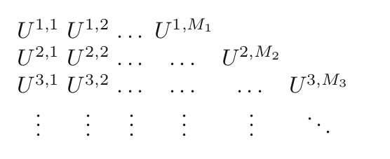

```{r setup, include=FALSE}
knitr::opts_chunk$set(echo = FALSE)
```


## Asymptotic Justifications

Now we get into the mathematics of some limit theorems that will help justify our SISR algorithm. This is all contained in chapter 9 of the text.

The book's organization of chapter 9:

  - breaks everything up into pieces
  - introduces a law of large numbers before a central limit theorem
  - hides most of the details in the last section 9.5
  
We will start with 9.5, and then use its **two** main theorems to work our way through 9.1-9.4

But first, we'll start with 9.2.2 to get some definitions.


## Triangular Array

A **triangular array** $\{U_{N,i}\}_{1\le i \le M_N}$ is just a collection of random variables on a common probability space. The number of "columns" may change, but generally increases with the row number $N$.

The row $N$ goes from $1,2,3\ldots$, and the column index is nested in the row in the sense that $i=1,\ldots,M_N$.

\begin{enumerate}
\item (not necessary but) usually $M_1 < M_2 < \cdots$ (in practice $M_i$ are all equal because we keep the number of particles fixed)
\item always $M_N \to \infty$ as $N \to \infty$
\item random variables within row are neither necessarily independent or identical
\end{enumerate}


```{r, out.width="700px"}

```


## Triangular Array: example 1

The usual asymptotic setup may be described as a triangular array
$$
\begin{array}{ccc}
X_1 & &  \\
X_1 & X_2 &    \\
X_1 & X_2 & X_3  \\
\vdots & \vdots && \ddots
\end{array}
$$
where $M_1 = 1$, $M_2 = 2$, and in general $M_N = N$, and within each row, all variables are iid.


## Triangular Array: example 2

```{r, out.width="700px"}

```

In our setup, unlike the usual setup,

  - we **do not** assume that all elements of a row but the last are repeated from the previous row, and
  - within a row, we may omit assumptions of independence and/or identicalness


## Filtrations

We will need to talk about a lot of conditional expectations, and the things we're conditioning on will change from row to row. 

Assume that all random variables in our triangular array are defined on the common probability space $(\Omega, \mathcal{F}, \mathbb{P})$. 

Also, when we are only referring to the samples without the weights, we will talk about the measurable space $(\mathsf{X}, \mathcal{X})$. We omit the probability measure in this case, because there is no unique measure. We have the target, and different choices of proposal measures.

## Filtrations


Let $\{\mathcal{G}^N\}_{N=1}^{\infty}$ be a sequence of sub-$\sigma$-fields of $\mathcal{F}$. 

1. A triangular array $\{U_{N,i}\}_{1 \le i \le M_N}$ is **measurable with respect to $\{\mathcal{G}^N\}_{N=1}^{\infty}$** if, for any $N$, all of $U^{N,1}, \ldots, U^{N,M_N}$ are all $\mathcal{G}^N$-measurable.

2. A triangular array $\{U_{N,i}\}_{1 \le i \le M_N}$ is **conditionally-independent given** $\{\mathcal{G}^N\}_{N=1}^{\infty}$ if, for any $N$, $U^{N,1}, \ldots, U^{N,M_N}$ are all conditionally independent given $\mathcal{G}^N$.

3. A triangular array $\{U_{N,i}\}_{1 \le i \le M_N}$ is **conditionally-iid given** $\{\mathcal{G}^N\}_{N=1}^{\infty}$ if, for any $N$, $U^{N,1}, \ldots, U^{N,M_N}$ are all conditionally iid given $\mathcal{G}^N$.

## Weighted-Samples

Now pretend each $U_{N,i}$ is a pair $(\xi^{N,i}, \omega^{N,i})$.

A triangular array of random variables $\{(\xi^{N,i}, \omega^{N,i})\}_{1 \le i \le M_N}$ is a **weighted sample** if for any $N$, $\omega^{N,i} \ge 0$ for the entire row (all $i$), and $\sum_{i=1}^{M_N} \omega^{N,i} > 0$ almost surely.

In other words, 

- no individual unnormalized weight can be negative, and 
- there is always at least one of them that is strictly positive. 

We need the second part so we can normalize them into weights that sum to $1$.

## Consistency

**Consistency** always refers to convergence in probability. We need to be a little bit more precise for our situation, though.

We use weighted samples to approximate expectations. However, we need to be specific about

  1. which probability measure we're taking expectations with respect to, and 
  2. what particular functions have a finite expectation when it comes to that particular measure.
  
## Consistency

A triangular array of random variables $\{(\xi^{N,i}, \omega^{N,i})\}_{1 \le i \le M_N}$ is **consistent for the probability measure $\nu$ and the set of functions $\mathsf{C} \subseteq L^1(\mathsf{X}, \nu)$** if for any $f \in \mathsf{C}$
$$
\frac{ \sum_i \omega^{N,i} f(\xi^{N,i}) }{ \sum_j \omega^{N,j} } \overset{\text{p}}{\to} \nu(f)
$$
as $N \to \infty$.

## Propriety (aka proper-ness)

Often we will need to have guarantees that certain functions are approximable as long as other functions are.

A set $\mathsf{C}$ of real-valued measurable functions is said to be **proper** if 

1. $\mathsf{C}$ is a linear space (i.e. that it is closed under linear combinations), and 
2. $|g| \in \mathsf{C}$ , $f$ is measurable, and $|f| \le |g|$ imply that $|f| \in \mathsf{C}$

## Other terminology

For any function $f$ define

- $f^+ \overset{\text{def}}{=} \max\{f,0\}$

- $f^- \overset{\text{def}}{=} \max\{-f,0 \}$

Small exercise: show that 

2. if $|g| \in \mathsf{C}$ , $f$ is measurable, and $|f| \le |g|$ imply that $|f| \in \mathsf{C}$

also implies that $f \in \mathsf{C}$.

## Small exercise: solution

1. $f$ measurable implies $f^+$ and $f^-$ measurable

2. $|f^+| \le |f|$ and $|f^-| \le |f|$ so $|f^+|$ and $|f^-|$ are in $\mathsf{C}$

3. but $|f^+| = f^+$ and $|f^-| = f^-$, so they are also in $\mathsf{C}$

4. finally, $f = f^+ - f^- = (1)f^+ + (-1)f^-$, and so $f \in \mathsf{C}$ by proper-ness