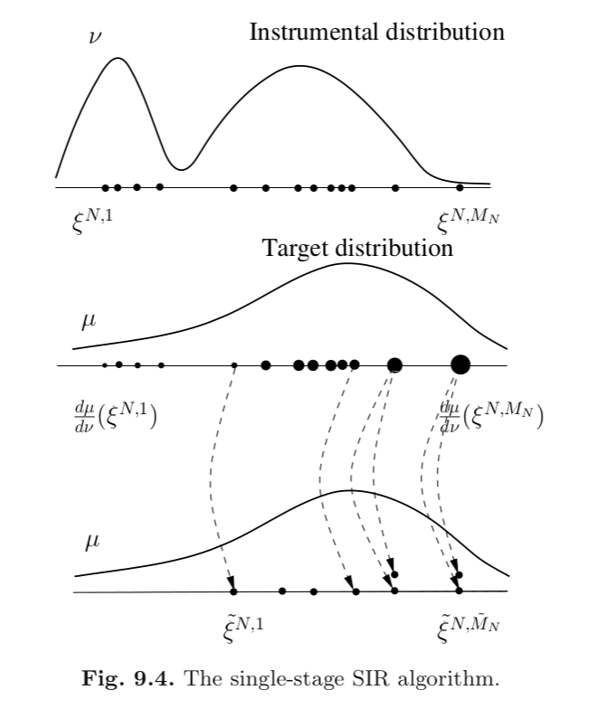

```{r setup, include=FALSE}
knitr::opts_chunk$set(echo = FALSE)
```


## Roadmap

9.1

- back to non-time series situation

- importance sampling -> self-normalized importance sampling

- mostly proof-free (classical asymptotics)

9.2

- **sampling importance resampling/IS with resampling/factored sampling** 

9.3

- sequential importance sampling with resampling (single-step analysis)

9.4

- sequential importance sampling with resampling (multi-step analysis)


## Overview

Before, with IS and Self-Normalized IS, we had weighted samples. If we ignored the weights, the sampled are distributed according to the proposal/instrumental distribution, **not the target distribution!**

Now we will add **resampling** as a second step. The result is **unweighted samples** that are (asymptotically) independently and identically distributed according to the **target distribution.**

The assumptions we will need are the same as Self-Normalized IS.


## Overview

```{r, echo=F, out.width="500px"}

```


## SIR from 10,000 feet

Recall that there are two steps to this algorithm:

1. Draw $\xi^1, \ldots, \xi^M$ from the proposal, and weight them accordingly.

2. Use the weights to **resample** draws $\tilde{\xi}^1, \ldots, \tilde{\xi}^{\tilde{M}}$.

In practice, I often set $M$ equal to $\tilde{M}$, but the book assumes their relationship is $M / \tilde{M} = \alpha$.

## Resampling in More Detail

We resample one $\tilde{\xi}^i$ from $\xi^1, \xi^2, \ldots$ by picking a random index $I^i$ and defining

$$
\tilde{\xi}^i = \xi^{I^i}
$$

So the question becomes, how do we pick the index that is used to select a resample?


## Resampling in More Detail

We want to give a higher chance to samples with large weights. And we want the weights to sum to $1$.

$I^1, \ldots, I^{\tilde{M}}$ are identically and independently distributed according to 

$$
P(I = i \mid \xi^1, \ldots, \xi^M) = \frac{ \frac{d\mu}{d\nu}(\xi^i) }{ \sum_{j=1}^M \frac{d\mu}{d\nu}(\xi^j) }
$$

## Resampling in More Detail

Algorithmically, I tend to think of drawing indices. Some indices may repeat because we are sampling with replacement (otherwise the index draws wouldn't be iid).

One may also consider the count vector that describes how often each of the stage one samples were selected: $N^1, \ldots, N^M$. 

For example, if exactly two indices from $\{I^i\}_{i=1}^{\tilde{M}}$ were equal to $3$, then $N^3 = 2$.

## Our Estimator

We end up with two equivalent expressions for a third importance sampling-based estimator of the expectation of some measurable function $f$:

$$
\hat{\mu}^{\text{SIR}}_{\nu, M, \tilde{M}}(f) = \frac{1}{\tilde{M}} \sum_{i=1}^{\tilde{M}} f(\tilde{\xi}^i) = \frac{1}{\tilde{M}} \sum_{i=1}^{M} f(\xi^i)N^i.
$$