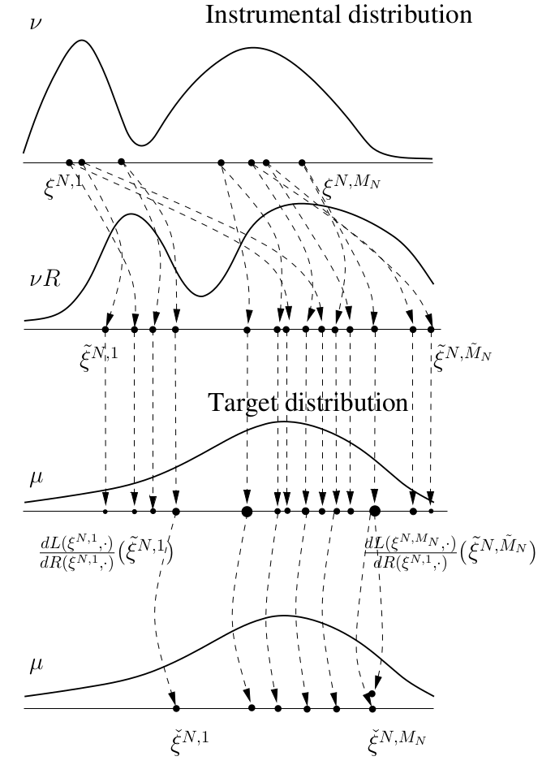

```{r setup, include=FALSE}
knitr::opts_chunk$set(echo = FALSE)
```


## Roadmap

9.2

- sampling importance resampling/IS with resampling/factored sampling 

9.3

- **sequential importance sampling with resampling (single-step analysis)**

9.4

- sequential importance sampling with resampling (multi-step analysis)

## Overview

```{r, echo=FALSE, out.width="400px"}

```


## Last class: Theorem 9.3.5

Assume 

1. Assumption 9.3.1: $0 < L(x,\mathsf{X}) < \infty$.

2. Assumption 9.3.2: $\{(\xi^{N,i},1)\}_{1 \le i \le M_N}$ are consistent for $(\nu, \mathsf{C})$. $L(x,\mathsf{X}) \in \mathsf{C}$.

3. Assumption 9.3.3: $\forall x \in \mathsf{X}$, $L(x, \cdot) \ll R(x, \cdot)$, and there exists a strictly positive RN derivative: $\frac{dL(x,\cdot )}{dR(x, \cdot)}$.

and define 
$$
\tilde{\mathsf{C}} = \left\{ f \in L^1(\mathsf{X}, \mu) : x \mapsto L(x, |f|) \in \mathsf{C}  \right\}.
$$

Then $\tilde{\mathsf{C}}$ is proper and $\{ (\tilde{\xi}^{N,i}, \tilde{\omega}^{N,i} )\}_{1 \le i \le M_N}$ is consistent for $(\mu, \tilde{\mathsf{C}})$.

...now we want a CLT!

## Theorem 9.3.7

Recall $\tilde{\mathsf{C}} = \left\{ f \in L^1(\mathsf{X}, \mu) : x \mapsto L(x, |f|) \in \mathsf{C}  \right\}$ and assume 

1. Assumption 9.3.1: $0 < L(x,\mathsf{X}) < \infty$.

2. Assumption 9.3.2: $\{(\xi^{N,i},1)\}_{1 \le i \le M_N}$ are consistent for $(\nu, \mathsf{C})$. $L(x,\mathsf{X}) \in \mathsf{C}$.

3. Assumption 9.3.3: $\forall x \in \mathsf{X}$, $L(x, \cdot) \ll R(x, \cdot)$, and there exists a strictly positive RN derivative: $\frac{dL(x,\cdot )}{dR(x, \cdot)}$.

4. Assumption 9.3.6: the weighted sample $\{(\xi^{N,i}, 1)\}_{1 \le i \le M_N}$ is asymptotically normal for $(\nu, \mathsf{A}, \sigma, M_N^{1/2})$, where $\mathsf{A}$ is proper, and $\sigma$ is some nonnegative function on $\mathsf{A}$.

Then $\tilde{\mathsf{A}}$ is proper, and $\{ (\tilde{\xi}^{N,j}, \tilde{\omega}^{N,j} )\}_{1 \le j \le M_N}$ is asymptotically normal for $(\mu, \tilde{\mathsf{A}}, \tilde{\sigma}, M_N^{1/2})$.

## Theorem 9.3.7

Where
$$
\tilde{\mathsf{A}} \overset{\text{def}}{=} \left\{ f \in L^2(\mathsf{X}, \mu) : L(x,f) \in \mathsf{A}, x \mapsto \int R(x,dx')\left[ \frac{dL(x,\cdot)}{dR(x,\cdot)}(x') f(x') \right]^2 \in \mathsf{C} \right\}
$$

and for $f \in \tilde{\mathsf{A}}$,
$$
\tilde{\sigma}^{1/2}(f) \overset{\text{def}}{=} \frac{ \sigma^2\left\{ L[f - \mu(f)] \right\} + \frac{1}{\alpha}\eta^2\left[f - \mu(f) \right] }{ \left[ \nu L(\mathsf{X}) \right]^2 },
$$
and in this expression
$$
\eta^2(f) \overset{\text{def}}{=} \iint \nu(dx) R(x,dx')\left[ \frac{dL(x,\cdot)}{dR(x,\cdot)}(x') f(x') \right]^2 - \int \nu(dx) [L(x,f)]^2
$$

Think "law of total variance."


## Theorem 9.3.7: proof (just propriety)

We can show $\tilde{\mathsf{A}}$ is proper, but we'll push all the other details to `proof_9.3.7.pdf`.

First, let's pick $|f| \in \tilde{\mathsf{A}}$ and $|g| \le |f|$ in order to show $|g| \in \tilde{\mathsf{A}}$. 

Like always, we use propriety in the earlier sets to show propriety in the new set. The assumed inequality implies that 

1. $L(x,|g|) \le L(x, |f|) \in \mathsf{A}$, and
2. $\nu(dx) R(x,dx')\left[ \frac{dL(x,\cdot)}{dR(x,\cdot)}(x') |g|(x') \right]^2 \le  \nu(dx) R(x,dx')\left[ \frac{dL(x,\cdot)}{dR(x,\cdot)}(x') |f|(x') \right]^2 \in \mathsf{C}$


## Theorem 9.3.7: proof (just propriety)

Second, $f,g \in \tilde{\mathsf{A}}$, and $\alpha,\beta \in \mathbb{R}$


