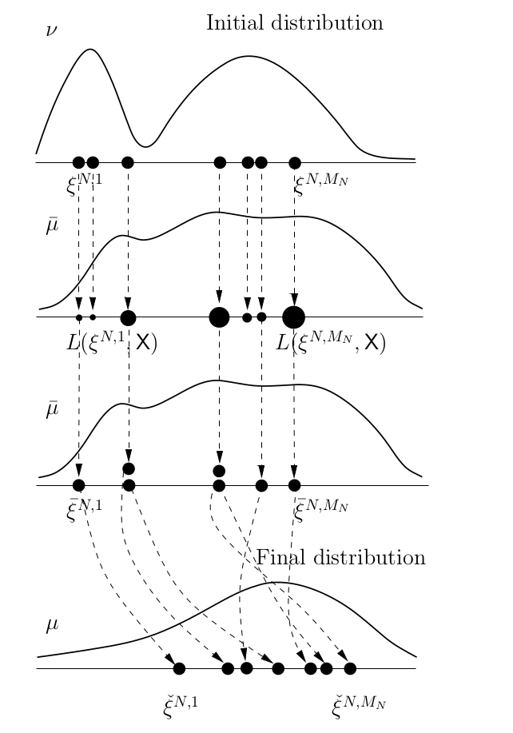
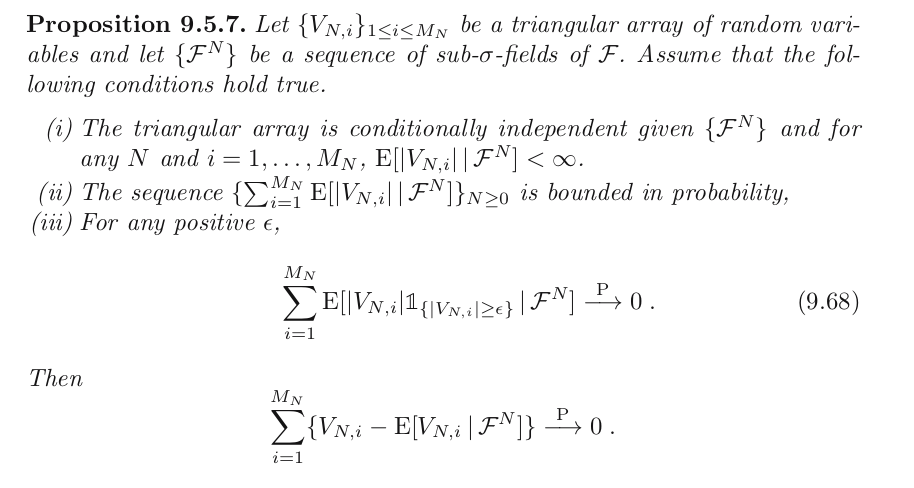

```{r setup, include=FALSE}
knitr::opts_chunk$set(echo = FALSE)
```


## Roadmap

9.2

- sampling importance resampling/IS with resampling/factored sampling 

9.3

- **sequential importance sampling with resampling (single-step analysis)**

9.4

- sequential importance sampling with resampling (multi-step analysis)

## Overview

Today we add the last step in this diagram:

```{r, echo=FALSE, out.width="400px"}
knitr::include_graphics("single-step-diagram.png")
```


## Note

We only deal with mutation/selection; not selection/mutation. 

Ignore the following diagram:

```{r, echo=FALSE, out.width="400px"}

```


## The Mutation/Selection algorithm

1. Draw $\tilde{\xi}^{N,1}, \ldots, \tilde{\xi}^{N,\tilde{M}_N}$ conditionally independently from $\mathcal{F}^N = \sigma\left(\xi^{N,1}, \ldots, \xi^{N,M_N} \right)$ according to the distribution $R(\xi^{N,i}, \cdot)$ for $i=1,\ldots,M_N$ and $j_i = \alpha_N(i-1)+1,\ldots,\alpha_N i$. Assign $\tilde{\xi}^{N,j}$ the unnormalized weight $\frac{dl(\xi^{N,i},\cdot)}{dR(\xi^{N,i},\cdot)}(\tilde{\xi}^{N,j})$.

2. Draw $M_N$ random index variables $I^{N,1},\ldots,I^{N,M_N}$ conditionally independently given $\check{\mathcal{F}}^N = \mathcal{F}^N \vee \sigma\left(\tilde{\xi}^{N,1},\ldots, \tilde{\xi}^{N,\tilde{M}_N} \right)$ with probability mass function $P(I^{N,i} = j) \propto \tilde{\omega}^{N,j}$. Finally, set $\check{\xi}^{N,i} = \tilde{\xi}^{N,I^{N,i}}$.


## Theorem 9.3.11

1. Assumption 9.3.1: $0 < L(x,\mathsf{X}) < \infty$.

2. Assumption 9.3.2: $\{(\xi^{N,i},1)\}_{1 \le i \le M_N}$ are consistent for $(\nu, \mathsf{C})$. $L(x,\mathsf{X}) \in \mathsf{C}$.

3. Assumption 9.3.3: $\forall x \in \mathsf{X}$, $L(x, \cdot) \ll R(x, \cdot)$, and there exists a strictly positive RN derivative: $\frac{dL(x,\cdot )}{dR(x, \cdot)}$.

and define 
$$
\tilde{\mathsf{C}} = \left\{ f \in L^1(\mathsf{X}, \mu) : x \mapsto L(x, |f|) \in \mathsf{C}  \right\}.
$$

Then 

- $\tilde{\mathsf{C}}$ is proper,

- $\{ (\tilde{\xi}^{N,i}, \tilde{\omega}^{N,i} )\}_{1 \le i \le M_N}$ is consistent for $(\mu, \tilde{\mathsf{C}})$, and 

- $\{ (\check{\xi}^{N,i}, 1 )\}_{1 \le i \le M_N}$ is consistent for $(\mu, \tilde{\mathsf{C}})$


## Theorem 9.3.11: proof

The first 2 of these three we already had from Theorem 9.3.5.

According to the text, the last follows from 9.2.9 (day 19 notes), but this in turn followed from Proposition 9.5.7. We can prove it directly from that.


## Theorem 9.3.11: proof

So in total we have four pieces of information we can use (first three by assumption)

1. Assumption 9.3.1: $0 < L(x,\mathsf{X}) < \infty$.

2. Assumption 9.3.2: $\{(\xi^{N,i},1)\}_{1 \le i \le M_N}$ are consistent for $(\nu, \mathsf{C})$. $L(x,\mathsf{X}) \in \mathsf{C}$.

3. Assumption 9.3.3: $\forall x \in \mathsf{X}$, $L(x, \cdot) \ll R(x, \cdot)$, and there exists a strictly positive RN derivative: $\frac{dL(x,\cdot )}{dR(x, \cdot)}$

4.  $\{ (\tilde{\xi}^{N,i}, \tilde{\omega}^{N,i} )\}_{1 \le i \le M_N}$ is consistent for $(\mu, \tilde{\mathsf{C}})$

## Theorem 9.3.11: proof


for any $f \in \tilde{\mathsf{C}}$

$$
M_N^{-1}\sum_{i=1}^{M_N}f(\check{\xi}^{N,i})-\mu(f)  =
$$
$$
\left\{\frac{1}{M_N}\sum_{i=1}^{M_N}\left(f(\check{\xi}^{N,i}) - E\left[f(\check{\xi}^{N,i}) \bigg\rvert \check{\mathcal{F}}^N \right] \right) \right\} + \left\{ \frac{1}{M_N}\sum_{i=1}^{M_N}E\left[f(\check{\xi}^{N,i}) \bigg\rvert \check{\mathcal{F}}^N \right]  -\mu(f)\right\}
$$

the first piece will converge to $0$ by Proposition 9.5.7. The second piece will go to $0$ by the first half of this result (aka Theorem 9.3.5.).

## Theorem 9.3.11: proof


```{r, echo=FALSE, out.width="800px"}

```


Let $V_{N,i} = \frac{f(\check{\xi}^{N,i})}{M_N}$ and consider $\check{\mathcal{F}}^N$ (add the check).