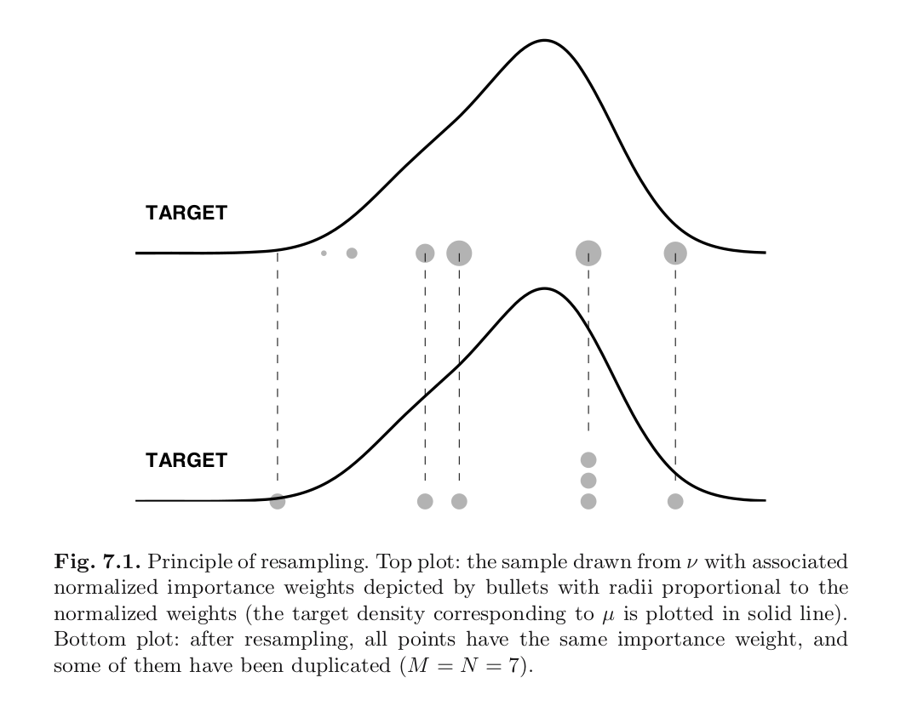

```{r setup, include=FALSE}
knitr::opts_chunk$set(echo = FALSE)
```

## Overview

We'll talk about Monte Carlo, Importance Sampling, and Sampling Importance Resampling (aka Factored Sampling)

Particle filtering, which we'll get to later, is basically these algorithms applied over and over again at each time point. 

So it's very important we understand the single time-period algorithms very well. 

## Monte Carlo

- target distribution: $\mu$ on $(\mathsf{X}, \mathcal{X})$
- quantities of interest: $\mu(f)$, $f$ is real-valued and measurable
- simulate from target, and compute sample mean

1. Draw $\xi^1, \ldots, \xi^N \sim \mu$ independently and identically
2. Calculate 
$$
\hat{\mu}(f) = N^{-1}\sum_{i=1}^N f(\xi^i)
$$

Useful for complicated $f$s, but you can't always simulate from target if it's complicated as well.

## Importance Sampling

- target distribution: $\mu$ on $(\mathsf{X}, \mathcal{X})$ 
- quantities of interest: $\mu(f)$, $f$ is real-valued and measurable
- simulate from instrumental/proposal distn. $\nu$ such that $\mu \ll \nu$
- compute **weighted** average

1. Draw $\xi^1, \ldots, \xi^N \sim \nu$ independently and identically
2. Calculate 
$$
\tilde{\mu}_{\nu,N}(f) = N^{-1}\sum_{i=1}^N f(\xi^i) \frac{d\mu}{d\nu}(\xi^{i})
$$

Now you can target distributions that you can't sample from!

## A note on Radon-Nikodym derivatives

If $\mu \ll \nu$ then the RD derivative exists. 

Basically, you can't choose $\nu$ that would necessitate dividing by $0$. In particular:

1. you can't target continuous random variables with a discrete proposal 
2. you can't target discrete random variables with a continuous proposal
3. you can't target anything if the support isn't wide enough (e.g. don't target a Gaussian with a Gamma)
4. If $\mu \ll \nu \ll \lambda$ (e.g. $\lambda$ is Lebesgue or counting measure) then 

$$
\frac{d\mu}{d\nu} = \frac{d \mu}{d\lambda} \bigg/ \frac{d\nu}{d\lambda}  \hspace{10mm} \lambda \text{ a.e.}
$$
i.e. it's just a ratio of densities or ratio of pmfs in the situations we're talking about.


## Importance Sampling

IS is just MC in disguise.

$$
\tilde{\mu}_{\nu,N}^{\text{IS}}(f) = N^{-1}\sum_{i=1}^N f(\xi^i) \frac{d\mu}{d\nu}(\xi^{i})
$$

The idea:
$$
\mu(f) = \int f(x) \mu(dx) = \int f(x) \frac{d\mu}{d\nu}(x)\nu(dx)
$$

or in other notation 
$$
E_{m}[f(X)] = \int f(x) m(x)dx = \int f(x) \frac{m(x)}{n(x)}n(x)dx = E_{n}\left[f(X) \frac{m(X)}{n(X)} \right]
$$

## Self-Normalized Importance Sampling

- Before, we targetted a distribution whose density/pmf we could evaluate
- Most of the time, we will only be able to evaluate an unnormalized version of it (e.g. $\mu$ is a posterior)

 
\begin{align*}
\hat{\mu}_{\nu,N}^{\text{IS}}(f) &= N^{-1}\sum_{i=1}^N f(\xi^i) \frac{d\mu}{d\nu}(\xi^{i}) \bigg/N^{-1}\sum_{i=1}^N  \frac{d\mu}{d\nu}(\xi^{i}) \\
&= \sum_{i=1}^N f(\xi^i) \frac{d\mu}{d\nu}(\xi^{i}) \bigg/\sum_{i=1}^N  \frac{d\mu}{d\nu}(\xi^{i})\\
&= \sum_{i=1}^N f(\xi^i) \frac{d\mu_{\text{unnorm}} }{d\nu}(\xi^{i}) \bigg/\sum_{i=1}^N  \frac{d\mu_{\text{unnorm}} }{d\nu}(\xi^{i})
\end{align*}

- numerator and denominator both converge, so their ratio does too
- the actual computation resembles last line

## Sampling Importance Resampling aka Factored Sampling

- IS approximates expectations, it doesn't give you samples from $\mu$
- ignoring the associated weights, the samples are from $\nu$
- SIR aka FS, with an additional step, gives you samples from $\mu$ (approximately)
- main idea: after you do IS, **resample those samples using their associated weights**


## Sampling Importance Resampling aka Factored Sampling

### Stage 1:

- draw iid intermediate samples $\tilde{\xi}^1, \ldots, \tilde{\xi}^M \sim \nu$
- calculate for each $i$
$$
\omega^i = \frac{ \frac{d\mu}{d\nu}(\tilde{\xi}^i ) }{ \sum_{j=1}^M \frac{d\mu}{d\nu}(\tilde{\xi}^j) }
$$

...

## Sampling Importance Resampling aka Factored Sampling


### Stage 2:

- for $i=1,\ldots,N$, draw indexes $I^i$ iid from 
$$
P(I^i = k \mid \tilde{\xi}^1, \ldots, \tilde{\xi}^M) = \omega^k 
$$

- for $i=1,\ldots,N$ set 
$$
\xi^i = \tilde{\xi}^{I^i}
$$

## Sampling Importance Resampling aka Factored Sampling


1. You're ending up with **unweighted** samples $\xi^1, \ldots, \xi^N$. 

2. $M = N$ usually but sometimes it's beneficial to have $M > N$

3. Each weight's calculation required all intermediate samples, so final samples are not iid!

4. computationally, you can either draw indexes for each $\xi$, or you can draw the counts of the indexes of $\tilde{\xi}$ 

5. The final estimator is

$$
\hat{\mu}^{\text{SIR}}_{\nu, M, N}(f) = \frac{1}{N}\sum_{i=1}^N f(\xi^i) = \frac{1}{N}\sum_{i=1}^N N^i f(\tilde{\xi}^i)
$$

## Picture

```{r, echo=F,out.width = "700px"}

```


## Class Exercises

1. Show that $\hat{\mu}^{\text{IS}}_{\nu, N}(f)$ is a Rao-Blackwellized version of $\hat{\mu}^{\text{SIR}}_{\nu, M, N}(f)$, and that they're both **biased** (typo in book) if you're using the self-normalized approach. Show that they are unbiased when $\mu$ is tractable.

2. Assume you have a tractable $\mu$. Show that the last equation on page 213 is equivalent to the Rao-Blackwell theorem.
