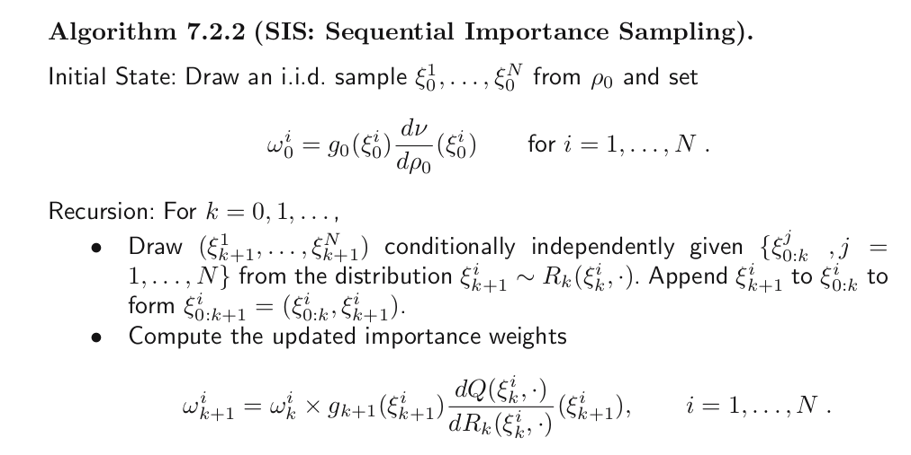
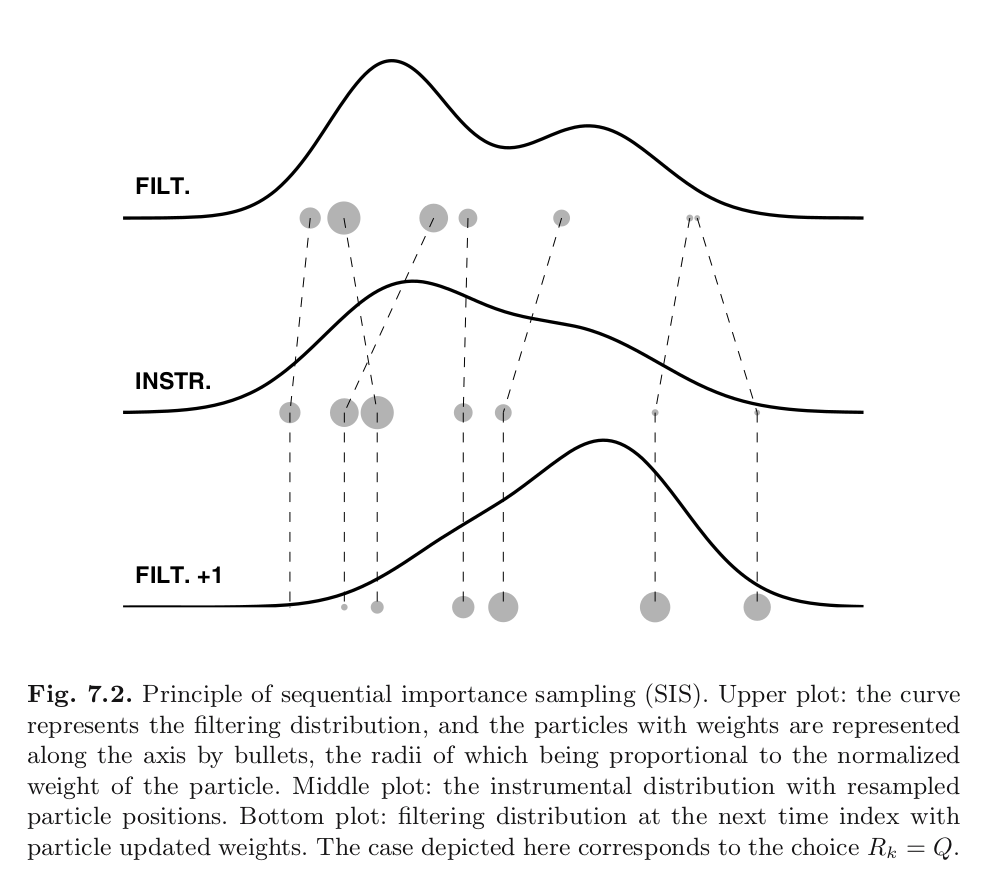

```{r setup, include=FALSE}
knitr::opts_chunk$set(echo = FALSE)
```


## Outline

Sequential Importance Sampling is barely  more complicated than regular importance sampling. There isn't any resampling yet, so it's just targetting an intractable smoothing distribution with some high dimensional proposal. 

The notation is just messier. That's it.


## Overview

First, it might help to outline this in more familiar notation. Recall:

- $g(y_t | x_t)$ is the observation density
- $q(x_t \mid x_{t-1})$ is the state transition density, $n(x_0)$ is the first time's state distribution
- target: $p(x_{0:t} \mid y_{0:t})$
- we can only evaluate 
$$
p(x_{0:t}, y_{0:t}) = n(x_0)g(y_0 | x_0)q(x_1 \mid x_0)g(y_1 \mid x_1) \times \cdots \times q(x_n \mid x_{n-1})g(y_n \mid x_n)
$$
- not 
$$
p(x_{0:t} \mid y_{0:t}) = \frac{p(x_{0:t}, y_{0:t})}{ \underbrace{p(y_{0:t})}_{\text{intractable}} }
$$


## Overview

So we sample 
$$
x^i_{0:t} \sim r(x_{0:t})
$$
and calculate 
$$
\sum_{i=1}^N \omega^i f(x^i_{0:t}) \bigg/ \sum_{j=1}^N \omega^j
$$
where 
$$
\omega^i = \frac{p(x^i_{0:t}, y_{0:t})}{r(x_{0:t}^i)}
$$

## \*Sequential\* Importance Sampling

Instead of sampling the entire path/trajectory at once, and then calculating all path weights at the end, we do it **sequentially**

\begin{align*}
\omega_t^i &= \frac{p(x^i_{0:t}, y_{0:t})}{r(x_{0:t}^i)} \\
&= \frac{p(x^i_{0:t-1}, y_{0:t-1})q(x_t^i \mid x^i_{t-1})g(y_t \mid x_t^i) }{r(x_{0:t-1}^i)r(x_t^i \mid x_{t-1}^i)} \\
&= \omega_{t-1}^i  \frac{q(x_t^i \mid x^i_{t-1})g(y_t \mid x^i_t) }{r(x_t^i \mid x_{t-1}^i)}
\end{align*}


## Notation Comparison: the initial smoothing distribution

$$
p(x_0 \mid y_0) = \frac{g(y_0 \mid x_0) n(x_0) }{\int g(y_0 \mid x') n(x') dx' }
$$

versus
$$
\phi_0(f) = \frac{\int f(x_0) g_0( x_0) \nu(d x_0) }{\int g_0( x') \nu(dx')  }
$$
where $f$ is any measurable, real-valued function.

We target $\phi_0$, but we can only evaluate an unnormalized version!


## Notation Comparison: new smoothing distn.s from old

For $k > 0$

$$
p(x_{0:k+1} \mid y_{0:k+1} ) = \left[\frac{p(y_{0:k})}{p(y_{0:k+1})}\right] g(y_{k+1} \mid x_{k+1})q(x_{k+1} \mid x_k)p(x_{0:k} \mid y_{0:k}) 
$$

versus
$$
\phi_{0:k+1 | k+1}(f) = \int\cdots \int f(x_{0:k+1})\phi_{0:k|k}(dx_{0:k}) \underbrace{\frac{L_{0:k}}{L_{0:k+1}}Q(x_k, dx_{k+1})g(x_{k+1})}_{T^u_k}
$$
where $f$ is any measurable, real-valued function. Note $T^u_k(x,\mathsf{X}) \neq 1$, so this kernel is not normalized (hence the $u$).

We target $\phi_{0:k+1 | k+1}$, but $\frac{L_{0:k}}{L_{0:k+1}}$ is typically intractable.


## Outline

### Targets (think posteriors):
  - $\phi_{0 |0}$, $\phi_{0:1 | 1}$, $\ldots$
  - $p(x_0 \mid y_0)$, $p(x_{0:1} \mid y_{0:1})$, $\ldots$

### Unnormalized Targets (think "complete-data" likelihoods)
  - $\nu(dx_0)g_0(x_0)$, $\nu(dx_0)g_0(x_0)Q(x_0,dx_1)g_1(x_1)$, $\ldots$
  - $p(x_0)g(y_0 \mid x_0)$, $p(x_0)g(y_0 \mid x_0)q(x_1 \mid x_0) g(y_1 \mid x_1)$, $\ldots$

### Proposals/Instrumental Distributions
  - $\rho_0(d x_0)$, $\rho_{0:1}(d x_{0:1}) = \rho_0(d x_0)R(x_0, dx_1)$, $\ldots$
  - $r(x_0)$, $r(x_{0:1})$, $\ldots$

  
## Main Idea

Motivation: for any measurable $f : \mathsf{X}^{k+1} \to \mathbb{R}$ 

$$
\phi_{0:k|k}(f) = \int \cdots \int f(x_{0:k}) \frac{d \phi_{0:k|k}}{d\rho_{0:k}}(x_{0:k}) \rho_{0:k}(dx_{0:k})
$$

if $\phi_{0:k|k} \ll \rho_{0:k}$ (i.e. $\phi_{0:k|k}$ is absolutely continuous with respect to $\rho_{0:k}$.)

The weights we calculate will be an unnormalized version of that RN derivative. 

## SIS: the algorithm


1. make sure $\phi_{0:k|k}$ is absolutely continuous with respect to $\rho_{0:k}$ by picking 
 
    * $\phi_0 \ll \rho_0$
 
    * $T^u_k(x,\cdot) \ll R_k(x,\cdot)$ for all $k$,$x$
  
2. sample paths/trajectories $\xi_{0:k}^i \sim \rho_{0:k}$

3. Calculate weighted average of samples

It's just self-normalized importance sampling!

## Main Idea

Note how the RN derivative factors
$$
\frac{d \phi_{0:k|k}}{d\rho_{0:k}}(x_{0:k}) = \frac{d\phi_0}{d \rho_0}(x_0)\prod_{l=0}^{k-1} 
\frac{dT^u_l(x_l, \cdot)}{dR(x_l, \cdot)}(x_{l+1}).
$$

Also, note that we can't evaluate any 
$$
\frac{dT^u_l(x_l, \cdot)}{dR(x_l, \cdot)}(x_{l+1}) = \frac{L_{0:l} }{L_{0:l+1}} g_{l+1}(x_{l+1} )\frac{d Q(x_l, \cdot ) }{dR(x_l, \cdot)}(x_{l+1}).
$$
But we can evaluate 

$$
g_{l+1}(x_{l+1} )\frac{d Q(x_l, \cdot ) }{dR(x_l, \cdot)}(x_{l+1})
$$

## More information on Step 2

Regarding step 2: sample paths $\xi_{0:k}^i \sim \rho_{0:k}$. This is done algorithmically as follows. 

For $i=1,2,\ldots,N$:

  a. draw $\xi_0^i \sim \rho_0(\cdot)$
  b. for $k > 0$, draw $\xi_k^i \sim R(\xi_{k-1}^i, \cdot)$ 

It's just simulating a Markov chain with transition kernel $R_k$!

## More information on Step 3

Regarding step 3, and the calculation of weights. It's done sequentially:

For $i=1,2,\ldots,N$:

  a. $\omega_0^i = g_0(\xi_0^i) \frac{d \nu}{d\rho_0}(\xi_0^i)$
  b. for $k> 0$, adjust unnormalized weights $\omega_{k+1}^i = \omega_{k}^i \times g_{k+1}(\xi_{k+1}^i) \frac{d Q( \xi_k^i, \cdot)}{dR(\xi^i_k, \cdot) }(\xi_{k+1}^i)$
  
Multiplicative updates.

NB: Evaluation of the tricky normalizing constant has been avoided!

## The Algorithm

```{r, echo=FALSE}

```

## The Picture

```{r, echo=FALSE, out.width = "620px"}

```


## Exercises

### Option 1:

- Show that 

    * $\phi_0 \ll \rho_0$
 
    * $T^u_k(x,\cdot) \ll R_k(x,\cdot)$ for all $k$,$x$

guarantees that $\phi_{0:k|k}$ is absolutely continuous with respect to $\rho_{0:k}$.

### Option 2:

Continue programming your SIS algorithm for the SVOL model using the data provided in Collab!