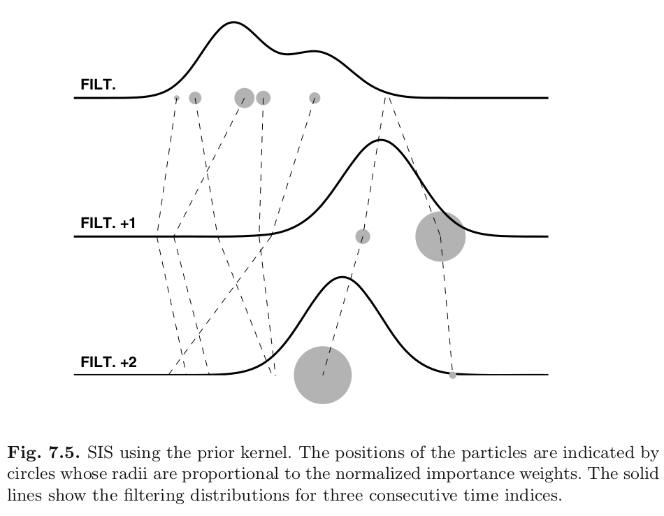
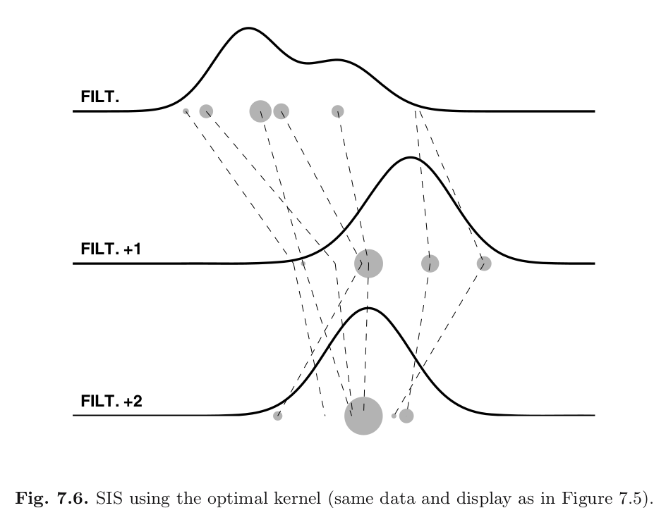

```{r setup, include=FALSE}
knitr::opts_chunk$set(echo = FALSE)
```


## Overview for \*Sequential\* Importance Sampling (SIS)

Any any given time $t$ we $N$ sample trajectories/paths 
$$
x^i_{0:t} \sim r(x_{0:t})
$$
as well as their unnormalized weights 
$$
\omega^i = \frac{p(x^i_{0:t}, y_{0:t})}{r(x_{0:t}^i)}.
$$ 

We approximate any expectation with 
$$
\sum_{i=1}^N \omega^i f(x^i_{0:t}) \bigg/ \sum_{j=1}^N \omega^j
$$


## \*Sequential\* Importance Sampling

The weights were updated **sequentially**

\begin{align*}
\omega_t^i &= \frac{p(x^i_{0:t}, y_{0:t})}{r(x_{0:t}^i)} \\
&= \frac{p(x^i_{0:t-1}, y_{0:t-1})q(x_t^i \mid x^i_{t-1})g(y_t \mid x_t^i) }{r(x_{0:t-1}^i)r(x_t^i \mid x_{t-1}^i)} \\
&= \omega_{t-1}^i  \frac{q(x_t^i \mid x^i_{t-1})g(y_t \mid x^i_t) }{r(x_t^i \mid x_{t-1}^i)}
\end{align*}

or
$$
\omega_{t}^i = \omega_{t-1}^i  \times g_{t}(x_{t}^i )\frac{d Q(x^i_{t-1}, \cdot ) }{dR(x^i_{t-1}, \cdot)}(x_{t}^i)
$$

## Today's Question

If 
$$
\omega_{t}^i = \omega_{t-1}^i  \times g_{t}(x_{t}^i )\frac{d Q(x^i_{t-1}, \cdot ) }{dR(x^i_{t-1}, \cdot)}(x^i_{t})
$$
how should we choose $R$?

## Example 1

Choose $R_t = Q$. The book calls this the "prior" kernel. 

Later, when we discuss the *resampling* procedure later, this choice of proposal will lead to the the Bootstrap Filter (statistics/machine learning), or the ConDensation algorithm (computer vision).

The weight update simplifies 
$$
 g_{t}(x_{t} )\frac{d Q(x_{t-1}, \cdot ) }{dR(x_{t-1}, \cdot)}(x_{t}) = g_{t}(x_{t} )
$$


## Example 1

Choose $R_t = Q$. 
$$
 g_{t}(x_{t}^i )\frac{d Q(x_{t-1}^i, \cdot ) }{dR(x^i_{t-1}, \cdot)}(x^i_{t}) = g_{t}(x^i_{t} )
$$

The problem with this is that drawing samples from $Q$ will rarely draw in the "correct" neighborhood where $\phi_{t|t}(dx_t)$ is high. 


## Example 1

```{r, echo=FALSE, out.width="700px"}

```


## Example 2

Choose the "optimal kernel"
$$
R_t(x_{t-1},dx_t) = \frac{Q(x_{t-1}, dx_t)g_t(x_t)}{\int Q(x_{t-1}, dx_t)g_t(x_t)}. 
$$

$$
 g_{t}(x_{t} )\frac{d Q(x_{t-1}, \cdot ) }{dR(x_{t-1}, \cdot)}(x_{t}) = \int Q(x_{t-1}, dx_t)g_t(x_t)
$$
completely free of $x_t$!

Usually impossible, but the closer you get to it, the better.

NB: actually, the book lists quite an interesting model where this would be feasible and Kalman filtering would not!

## Example 2

```{r, echo=FALSE, out.width="700px"}

```


## The (uncentered) Stochastic Volatility Model

state transition:

$$
X_k = \phi X_{k-1} + \sigma U_k
$$
or 

$$
Q(x_{k-1},d x_k) = \frac{1}{\sqrt{2\pi\sigma^2}} \exp\left[\frac{(x_{k} - \phi x_{k-1} )^2}{2 \sigma^2} \right]d x_k
$$

or

$$
q(x_{k-1},x_k) = \frac{1}{\sqrt{2\pi\sigma^2}} \exp\left[\frac{(x_{k} - \phi x_{k-1} )^2}{2 \sigma^2} \right]
$$


## The (uncentered) Stochastic Volatility Model

The observation equation

$$
y_k = \beta \exp\left[x_k/2 \right]v_k
$$
or $Y_k \mid X_k \sim \text{Normal}\left( 0, \beta^2 \exp\left[x_k \right]\right)$ or
$$
g_k(x_k) = \frac{1}{\sqrt{2\pi\beta^2}}\frac{1}{\exp\left[x_k/2 \right]} \exp\left[ -\frac{y_k^2}{2 \beta^2 \exp(x_k)} \right]
$$


## The (uncentered) Stochastic Volatility Model

What's the prior kernel?


## The (uncentered) Stochastic Volatility Model

What's the prior kernel?

\begin{align*}
r(x_k \mid x_{k-1}) &\overset{\text{set}}{=} q(x_{k-1},x_k) \\
&= \frac{1}{\sqrt{2\pi\sigma^2}} \exp\left[\frac{(x_{k} - \phi x_{k-1} )^2}{2 \sigma^2} \right] \\
\end{align*}

easy to simulate from a normal distribution...

## The (uncentered) Stochastic Volatility Model

What's the optimal kernel?


## The (uncentered) Stochastic Volatility Model

What's the optimal kernel?

$$
r(x_k \mid x_{k-1}) \overset{\text{set}}{\propto} q(x_{k-1},x_k) g_k(x_k)  
$$

but $\int q(x_{k-1},x_k) g_k(x_k) dx_k$ equals

$$
\int \frac{1}{\sqrt{2\pi\beta^2}}\frac{1}{\exp\left[x_k/2 \right]} \exp\left[ -\frac{y_k^2}{2 \beta^2 \exp(x_k)} \right]\frac{1}{\sqrt{2\pi\sigma^2}} \exp\left[\frac{(x_{k} - \phi x_{k-1} )^2}{2 \sigma^2} \right] dx_k \\
$$

 is impossible to integrate :(


##  Extras: Example 7.2.5

is a rather involved example, that describes choosing a proposal that is a t-distribution that is in some sense as close to $$
\frac{q(x_{k-1},x_k) g_k(x_k)}{ \int q(x_{k-1},x_k') g_k(x_k')dx_k'  }
$$
as possible. This is unimodal because it is log-concave. If it wasn't unimodal, we could approximate it with a mixture t distributions.


It uses iterative optimization at every iteration of the filter, though. So it's likely to be a lot slower, and it involves more bug-prone code.