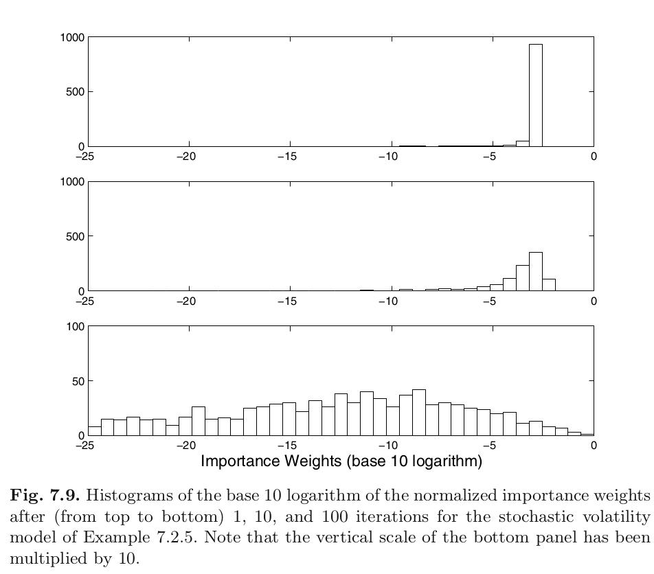
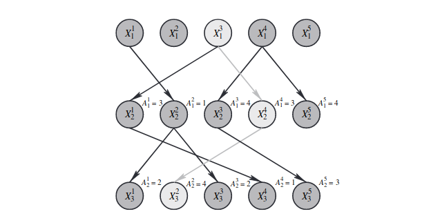
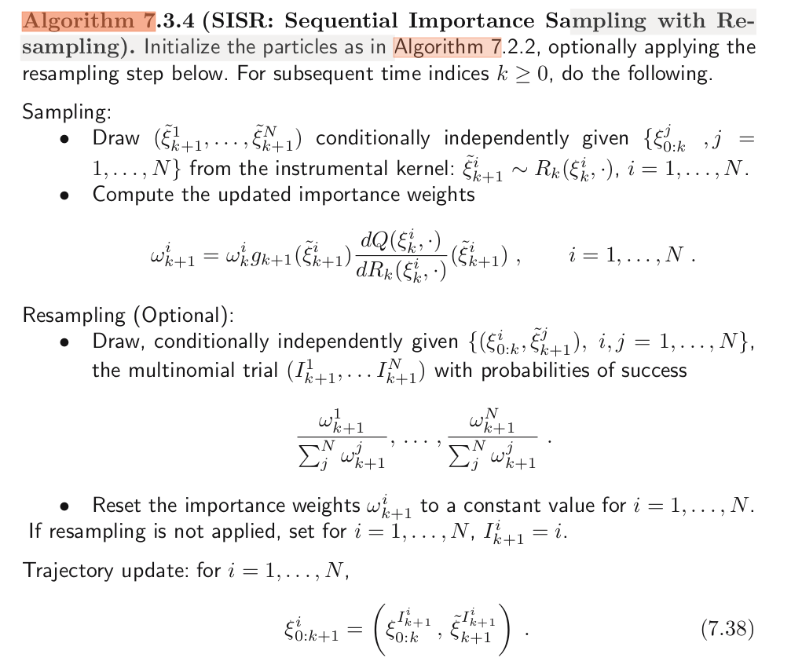
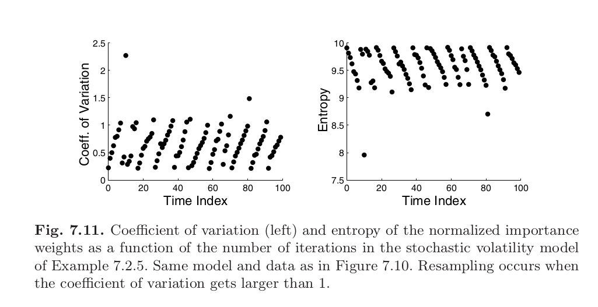
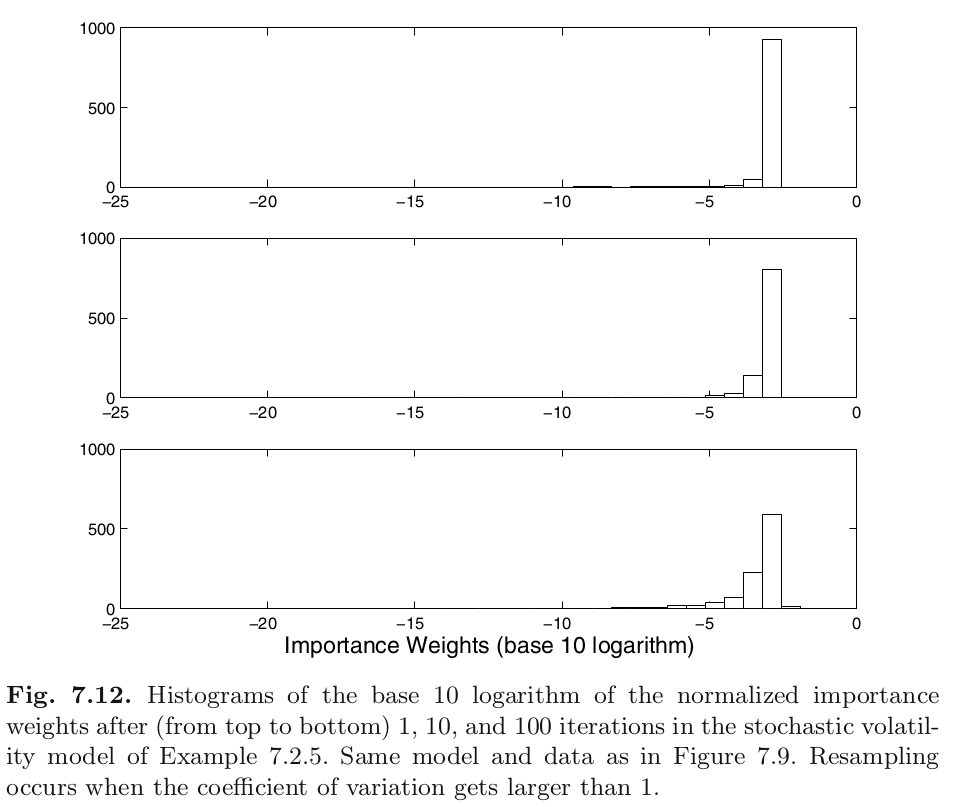

```{r setup, include=FALSE}
knitr::opts_chunk$set(echo = FALSE)
```


## The problem with SIS

Algorithm gives us 

- trajectories/paths/samples: $\xi^i_{0:k}$ (aka $x^i_{0:k}$), and 
- corresponding unnormalized weights: $w_k^i$.

What happens to $\{w_k^i\}_{i=1}^N$ when $k \to \infty$? What does this mean for our approximations to $\phi_{0:k\mid k}(f)$?


## The problem with SIS

Weight degeneracy in the stochastic volatility model

```{r, echo=F, out.width="500px"}

```

Has anyone noticed this in their code?


## Other ways to measure degeneracy

degeneracy means that as the time index increases

- effective sample size decreases, 

- coefficient of variation increases, and

- sample entropy (the average "surprise") decreases


## Optional: example 7.3.1

Hard to guarantee theoretically, but in practice it looks like it almost always happens. 

Example 7.3.1:

- assumes state transition is iid (stronger than Markov)
- uses standard mathematical statistics moves: CLT, LLN, Slutsky's
- they sample $x_{0:k}^i$ but only use $x_{k}^i$ in $f(x_{k}^i)$ (filtering)
- the weights depend on the entire path/trajectory, though
- asymptotic variance increases exponentially in $k$ because errors "build up" as one weight becomes more and more dominant
- typo in equation 7.34


## Resampling

In SIS, without resampling, each sample only made use of it's own past.

$$
x_t^i \mid x_{t-1}^i \sim R(x_{t-1}^i, dx_{t}^i)
$$

once we resample, we're basically shuffling the previous indexes around, and $x_t^i$ might depend on $x_{t-1}^j$ where $i\neq j$ and $j$ is random.

## Resampling

When you resample, you're drawing *with* replacement, which means usually there will be quite a few duplicates. This is good. You are duplicating particles in regions of high density, and you're discarding ones in regions of low density.

```{r, echo=F, out.width = "600px"}

```

source: [a cool paper](https://www.stats.ox.ac.uk/~doucet/andrieu_doucet_holenstein_PMCMC.pdf)


## Animation of Stochastic Volatility Model

```{r, echo=F, out.width = "600px"}
knitr::include_graphics("pfilt_anim_1.png")
```


## Animation of Stochastic Volatility Model

```{r, echo=F, out.width = "600px"}
knitr::include_graphics("pfilt_anim_2.png")
```


## Animation of Stochastic Volatility Model

```{r, echo=F, out.width = "600px"}
knitr::include_graphics("pfilt_anim_3.png")
```


## Animation of Stochastic Volatility Model

```{r, echo=F, out.width = "600px"}
knitr::include_graphics("pfilt_anim_4.png")
```


## Animation of Stochastic Volatility Model

```{r, echo=F, out.width = "600px"}
knitr::include_graphics("pfilt_anim_5.png")
```


## Animation of Stochastic Volatility Model

```{r, echo=F, out.width = "600px"}
knitr::include_graphics("pfilt_anim_6.png")
```


## Animation of Stochastic Volatility Model

```{r, echo=F, out.width = "600px"}
knitr::include_graphics("pfilt_anim_7.png")
```


## Animation of Stochastic Volatility Model

```{r, echo=F, out.width = "600px"}
knitr::include_graphics("pfilt_anim_8.png")
```


## Animation of Stochastic Volatility Model

```{r, echo=F, out.width = "600px"}
knitr::include_graphics("pfilt_anim_9.png")
```

## Animation of Stochastic Volatility Model

```{r, echo=F, out.width = "600px"}
knitr::include_graphics("pfilt_anim_10.png")
```

## SISR's description

```{r, echo=F, out.width = "600px"}

```


## On Remark 7.3.5

At the end of iteration $k+1$, you have an updated trajectory
$$
\xi_{0:k+1}^i = (\xi_{0:k}^{I_{k+1}^i}, \tilde{\xi}_{k+1}^{I_{k+1}^i} )
$$
for $i=1,\ldots,N$.

At the end of the iteration, when we select the index $I_{k+1}^i$, say it's 3, that means we pick the third proposal $\tilde{\xi}_{k+1}^{3}$ point to append to the trajectory at time $k+1$, **and** we pick the 3rd historical trajectory/path 
$$
\xi_{0:k}^{3}
$$

Computationally, copying around longer and longer paths becomes progressively slower. In practice, we tend to only keep track the most recent ends of the paths
$$
\tilde{\xi}_{k+1}^{I_{k+1}^i} \overset{\text{def}}{=} \xi_{k+1}^i
$$


## Some plots


```{r, echo=F, out.width = "600px"}

```


## Some plots


```{r, echo=F, out.width = "600px"}

```


